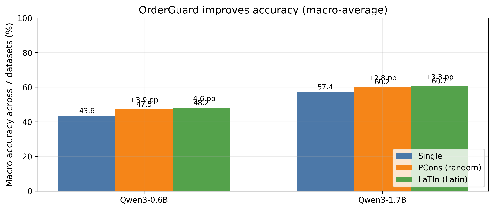
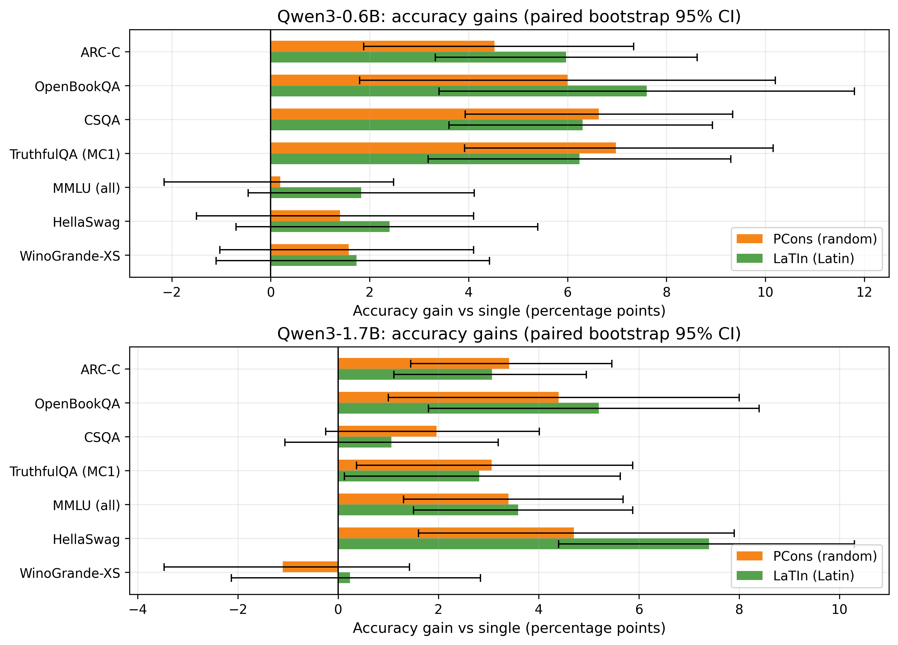

# OrderGuard: order-robust LLM judging, reranking, and tool selection (LaTIn / PCons)

Candidate order is *not* a meaningful signal - but many LLM pipelines accidentally treat it as one.

When you use an LLM to **pick 1 option out of N** (LLM-as-a-judge, RAG reranking, agent tool/action selection), simply reordering the same options can silently change the winner, making systems flaky and benchmarks noisy.

**OrderGuard** is a training-free inference wrapper that reduces order sensitivity by (approximately) **marginalizing over permutations** using forced-choice **logprob scoring** + an adaptive early-stop.

**TL;DR**

- Single-shot "pick one from a list" is wildly unstable under reorderings (58-75% flip rate with only 10 shuffles on Qwen3 in our benchmark).
- OrderGuard improves macro accuracy by **+2.8 to +4.6 pp** on Qwen3, with **up to +7.6 pp** on a single dataset.
- LaTIn is usually more compute-efficient than random shuffles (lower variance, fewer permutations).

**Framing (for papers): permutation-group averaging inference + low-variance sampling design + adaptive stopping**

- **Permutation-group averaging (inference-time invariance):** treat option order as a nuisance variable and marginalize it out by aggregating scores over permutations.
- **Low-variance design (LaTIn):** use a position-balanced cyclic schedule (Latin-square style) so each option appears in each position equally, reducing variance vs random shuffles.
- **Adaptive stopping:** stop when the aggregated distribution stabilizes (JS divergence threshold), allocating more test-time compute only to hard examples.

## Minimal API (works for tool/action selection too)

```python
from orderguard.methods import latin_consensus
from orderguard.modeling import load_lm

lm = load_lm("Qwen/Qwen3-1.7B", torch_dtype=None)

question = "Pick the best next tool for: extract the answer from a table."
choices = [
    "WebSearch: use the browser to find information online.",
    "Calculator: do arithmetic precisely.",
    "TableParser: read structured tables and extract fields.",
    "WriteCode: write a short script to compute the result.",
]

res = latin_consensus(lm, question, choices, max_perms=7, min_perms=3, js_eps=0.005, seed=0)
print("winner:", choices[res.pred_index], "perms_used:", res.meta["perms_used"])
```

## Why this matters (severity)

On Qwen3, *single-shot* multiple-choice is extremely order-sensitive: with just **10 random shuffles**, the predicted winner changes on:

- **75.3%** of questions (mean across 7 datasets) for `Qwen/Qwen3-0.6B` (max: **89.0%** on TruthfulQA(MC1))
- **58.2%** of questions for `Qwen/Qwen3-1.7B` (max: **82.5%** on HellaSwag)

Here "changes" means: for an example, if **any** of the 10 shuffled presentations produces a different winner than the original ordering.

This repo's goal is simple: make "pick one from a list" behave like it *should* - **stable under reordering** - without retraining.

## Headline results (Qwen3, fully reproducible)

Macro accuracy across 7 multiple-choice benchmarks (ARC-C, OpenBookQA, CSQA, TruthfulQA(MC1), MMLU(all), HellaSwag, WinoGrande-XS):

| Model | Single | PCons (random) | LaTIn (Latin) |
|---|---:|---:|---:|
| Qwen/Qwen3-0.6B | 43.6% | 47.5% (**+3.9 pp**) | 48.2% (**+4.6 pp**) |
| Qwen/Qwen3-1.7B | 57.4% | 60.2% (**+2.8 pp**) | 60.7% (**+3.3 pp**) |

Biggest per-dataset gains (accuracy, absolute pp vs single):

| Model | Dataset | Gain | Method |
|---|---|---:|---|
| Qwen/Qwen3-0.6B | OpenBookQA | **+7.6 pp** | LaTIn |
| Qwen/Qwen3-0.6B | TruthfulQA(MC1) | **+7.0 pp** | PCons |
| Qwen/Qwen3-0.6B | CSQA | **+6.6 pp** | PCons |
| Qwen/Qwen3-1.7B | HellaSwag | **+7.4 pp** | LaTIn |
| Qwen/Qwen3-1.7B | OpenBookQA | **+5.2 pp** | LaTIn |
| Qwen/Qwen3-1.7B | MMLU(all) | **+3.6 pp** | LaTIn |

Repro artifact (numbers + per-example logs): `reports/paper_qwen3/`.

Compute note (same run): with `max_perms=7`, `min_perms=3`, `js_eps=0.005`, LaTIn uses **~3.7-3.8** permutations per example on average, vs **~4.3-4.7** for PCons (single-shot is 1x).

Re-generate the exact figures from the artifact:

```powershell
.\.venv\Scripts\python -m orderguard.plots.make_figures --run_dir reports/paper_qwen3
```



Per-dataset accuracy gains (paired bootstrap 95% CI; gains are vs single-shot):



## Core idea: permutation-group averaging + low-variance design + adaptive stopping

We want a decision rule that does **not** change when options are reordered. Option permutations form a symmetry group; the standard way to enforce invariance is **group averaging**. Treat the presented order as a nuisance variable `pi`.

For each permutation `pi`, we ask the model a *forced-choice* question ("Answer with A/B/C/...") and record log-probs:

`ell_pi(i) = log p(letter = pos(i under pi) | question, options permuted by pi)`

Then we map each letter score back to the original option identity and aggregate:

`score(i) = sum_{pi in S} ell_pi(i)`  ->  `p(i) = softmax(score(i))`

This is a Monte-Carlo estimate of the permutation-marginal objective `E_pi[log p(i | pi)]`: if the model has **position bias** (e.g., "prefer option B" or "prefer earlier options"), averaging over permutations cancels it out.

### Why LaTIn beats random shuffles (often)

A simple bias decomposition explains the variance story:

`ell_pi(i) = u(i) + b(position of i in pi) + eps(i,pi)`

- `u(i)` is the "real" preference for option `i`.
- `b(pos)` is position bias.
- `eps` is residual noise.

Random shuffling cancels `b` **in expectation**; **LaTIn** uses a Latin-style cyclic schedule so each option appears in each position equally within one cycle, canceling `b` **exactly** per cycle (lower variance -> fewer permutations for the same stability).

### Adaptive early-stop (why it saves compute)

After each permutation, we update the aggregated distribution `p_t`. If `JS(p_t, p_{t-1}) < js_eps` (after `min_perms`), we stop.
Easy examples converge quickly; hard ones spend more test-time compute.

## Comparison to related approaches and baselines

Key advantages you can't get all at once from common baselines:

- **Training-free** and drop-in: no SFT/RL, no new model.
- **Short-output scoring**: only scores `A/B/C/...` logprobs (fast, deterministic; avoids generation format drift).
- **Order-robust by construction**: marginalizes option order instead of trying to prompt it away.
- **Adaptive compute**: spends permutations only when needed.
- **Lower-variance schedule (LaTIn)**: position-balanced permutations typically reach the same stability with fewer trials.

Comparison table (methods that target the *same* problem: order bias / list instability):

| Approach | Training-free | Uses logprobs | Works without logprobs | Order-robust mechanism | Compute scaling | Typical failure mode |
|---|---|---|---|---|---:|---|
| Single-shot | Yes | Optional | Yes | none | 1x | brittle to order/position bias |
| "Please ignore order" prompting | Yes | Optional | Yes | hope | 1x | unreliable, hard to verify |
| Shuffle once | Yes | Optional | Yes | breaks fixed bias once | 1x | high variance; still flips |
| K-shuffle vote (generation) | Yes | No | Yes | ensemble by vote | Kx | slow; parsing drift; nondeterminism |
| Pairwise tournament | Yes | Optional | Yes | compares pairs | O(N^2) | expensive when N grows |
| Train-time debiasing (SFT/RL) | No | N/A | N/A | changes the model | expensive | not drop-in; hard to reproduce |
| **OrderGuard PCons** | Yes | Yes | No | MC permutation marginalization + JS early-stop | ~Kx (adaptive) | needs logprobs |
| **OrderGuard LaTIn** | Yes | Yes | No | balanced (Latin-cycle) marginalization + JS early-stop | ~Kx (often smaller) | needs logprobs |

## Related work and positioning

OrderGuard targets a practical gap in today's LLM pipelines: **order bias** in "pick-1-from-N" decisions. Our contribution is a concrete, reproducible system that combines permutation-group averaging, a low-variance permutation schedule, and adaptive stopping into a single drop-in wrapper with clear evaluation.

To position the work precisely, here are representative lines of research by dimension:

- **Voting / ensembling:** e.g., *Self-Consistency Improves Chain of Thought Reasoning in Language Models* (Wang et al., arXiv:2203.11171) popularized sampling multiple reasoning paths and aggregating (vote/consensus).
- **Logprob forced-choice scoring:** classic LM evaluation pipelines score discrete answers via likelihood rather than free-form generation (e.g., *Language Models are Few-Shot Learners*, Brown et al., arXiv:2005.14165; and newer MCQA scoring analyses like *Choices Speak Louder than Questions*, arXiv:2502.18798).
- **Position bias / order effects:** work measuring position bias in LLM applications (e.g., *Revisiting Zero-Shot Abstractive Summarization... from the Perspective of Position Bias*, arXiv:2401.01989; *Evaluating Position Bias in Large Language Model Recommendations*, arXiv:2508.02020).
- **Stability metrics (prompt/order sensitivity):** work that explicitly measures sensitivity/robustness of LLM behavior to superficial changes (e.g., *ProSA: Assessing and Understanding the Prompt Sensitivity of LLMs*, arXiv:2410.12405; *Flaw or Artifact? Rethinking Prompt Sensitivity in Evaluating LLMs*, arXiv:2509.01790).
- **Low-variance sampling / balanced designs:** Latin square designs (Fisher, *The Design of Experiments*, 1935) and Latin hypercube sampling (McKay et al., 1979) are classical variance-reduction tools; LaTIn is a discrete, permutation-specialized analogue used to reduce variance in the permutation-group average.

## Quickstart

```powershell
cd c:\26spring\py\sf260129\orderguard
python -m venv .venv
.\.venv\Scripts\python -m pip install --upgrade pip
.\.venv\Scripts\python -m pip install -e .
```

Run (Qwen3 small models):

```powershell
.\.venv\Scripts\python -m orderguard.bench.run --models Qwen/Qwen3-0.6B Qwen/Qwen3-1.7B
.\.venv\Scripts\python -m orderguard.bench.sensitivity --models Qwen/Qwen3-0.6B Qwen/Qwen3-1.7B --examples 200 --perms 10
.\.venv\Scripts\python -m orderguard.plots.make_figures --run_dir reports/latest
```

Outputs:

- `reports/latest/summary.csv`: metrics by task x method x model
- `reports/latest/per_example__*.jsonl`: per-example logs (paired bootstrap)
- `reports/latest/figures/*.png|svg`: paper figures

## Repo layout

- `src/orderguard/`: methods + tasks + modeling
- `src/orderguard/bench/`: benchmarks (accuracy / sensitivity)
- `src/orderguard/plots/`: minimal paper figures
- `reports/paper_qwen3/`: frozen run artifact (Qwen3-0.6B/1.7B)

## Citation

See `CITATION.cff`.

## Chinese README

See: `README_zh.md`.
